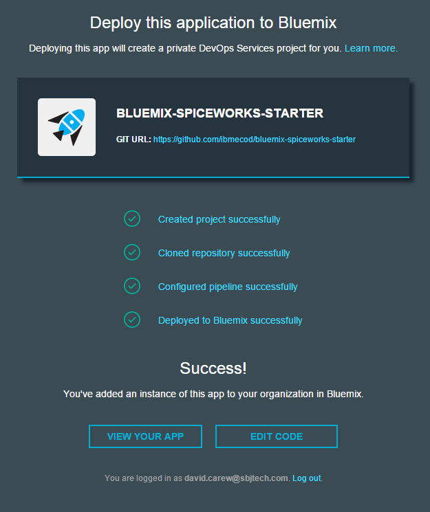
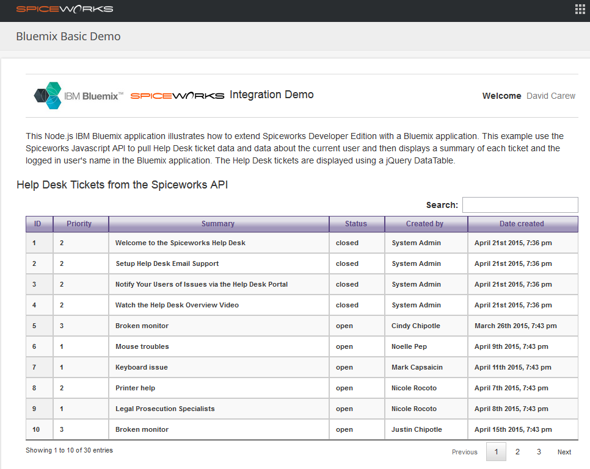

This simple  Node.js IBM Bluemix application illustrates how to extend [Spiceworks Developer Edition](http://spiceworks.github.io/developers.spiceworks.com/downloads/) with an [IBM Bluemix](https://console.ng.bluemix.net/?cm_mmc=IBMEcoDWW-_-IIC-_-BluemixDay-_-BluemixDayAAAWebpage)  application. This example uses the Spiceworks Javascript API to pull Help Desk ticket data and then displays a summary of each ticket  in the Bluemix application.

## Automatic Deploy (and signup if necessary) to Bluemix
Give it a try! Click the button below  and follow the prompts to fork into IBM DevOps Services and deploy your own copy of this application on Bluemix. Not signed up for  Bluemix already ? No worries, the 
button below works for new Bluemix users as well as existing ones. 

[](https://bluemix.net/deploy?repository=https://github.com/ibmecod/bluemix-spiceworks-starter)

Enjoy! (note, it may take minute or so for the app to start)

When you're done you can run the app by clicking on **View Your App** or look at the source code by clicking on **Edit Code**


___


## Manual deploy (not necessary if you clicked on _Automatic Deploy_ above)

1. Create a Bluemix Account

    [Sign up](https://console.ng.bluemix.net/?cm_mmc=IBMEcoDWW-_-IIC-_-BluemixDay-_-BluemixDayAAAWebpage) in Bluemix, or use an existing account.

2. Download and install the [Cloud-foundry CLI](https://github.com/cloudfoundry/cli/releases) tool

3. After cloning this project locally, edit the `manifest.yml` file and change the `<application-name>` to something unique.
  ```none
  applications:
    name: <application-name>
    command: node app.js
    path: .
    memory: 128M
  ```
  The name you use will determinate your application url initially, e.g. `<application-name>.mybluemix.net`.

4. Connect to Bluemix in the command line tool.
  ```sh
  $ cf api https://api.ng.bluemix.net
  $ cf login -u <your user ID>
  ```

5. Push it live!
  ```sh
  $ cf push
  ```
 
6. Access the running application using the URL `<application-name>`.mybluemix.net where `<application-name>` is the name you used in step 3. The welcome page will have instructions about integrating this app into Spiceworks Developer Edition

___

## Deploy into Spiceworks Developer Edition

Once you're up and running on Bluemix you can  integrate this sample into Spiceworks Developer Edition by completing the following steps:

1. From the Spiceworks UI select **_Apps->Inventory_** or **_Apps->Help Desk_**
2. Select **_Settings->All_** and click on **_Manage Apps_**
3. Select **_New App->New Platform App_**
4. Name the app and enter ```bmdemo ``` as the **_Namespace_**
5. Copy the your' apps URL and paste is as the **_App Host URL_**
6. Under _**App Permissions**_, give the app read access to all the data
7. Save your changes

Your Bluemix app will now appear (as shown below) when you invoke **_App->Your App Name_** from inside Spiceworks where **_Your App Name_** is the name you gave to the app.


	             
